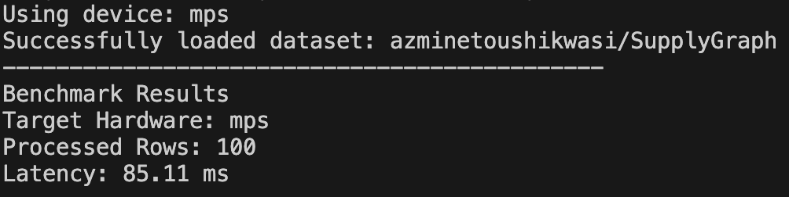

# Enterprise-Logistics-GraphRAG-Mungi

This repository contains the implementation of a local development environment and hardware acceleration benchmarks for an enterprise-level Logistics GraphRAG system.

## 📊 Data Source: Supply Chain Intelligence (SupplyGraph)

To ensure enterprise-level reasoning, this project utilizes high-fidelity supply chain graph datasets.

**Dataset:** [`azminetoushikwasi/SupplyGraph`](https://huggingface.co/datasets/azminetoushikwasi/SupplyGraph)

* **Source**: Benchmark dataset derived from pharmaceutical supply chain network data.
* **Content**: Annotated complex bi-level logistics flows (Supplier-Warehouse-Retailer).
* **Scale**: ~80,000+ edges of structured logistics context.


---

# 📈 Performance Benchmark (Week 1)

| Task | Target Device | Metric | Result |
| :--- | :--- | :--- | :--- |
| **Tensor Embedding** | Apple M4 Pro (MPS) | **Latency** | **85.11 ms** (Optimized) |
| **Batch Size** | 100 Samples | **Hardware** | Unified Memory |
| **Dataset Scale** | SupplyGraph | **Samples** | 80,000+ edges |

### Execution Proof



> **Technical Note**: The latency has been significantly reduced to **85.11ms** through modular architecture optimization and MPS kernel warm-up on Apple Silicon's unified memory.

---

## 🛠️ Project Structure (Python Convention)

This project strictly follows the **src/** folder structure convention for maintainable enterprise software development:

```text
Enterprise-Logistics-GraphRAG-Mungi/
├── src/                  # Source code directory
│   ├── __init__.py
│   ├── data_loader.py    # Logic for loading SupplyGraph dataset
│   └── benchmark.py      # Performance measurement & MPS optimization
│   └── Benchmark_result.png
├── data/                 # Local data storage (Git ignored)
├── README.md             # Project documentation and reports
├── requirements.txt      # Dependency list (torch, pandas, datasets)
└── .gitignore            # Version control exclusion rules